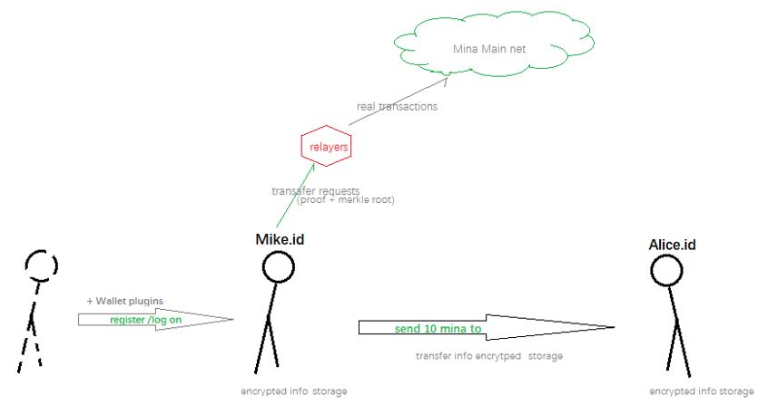
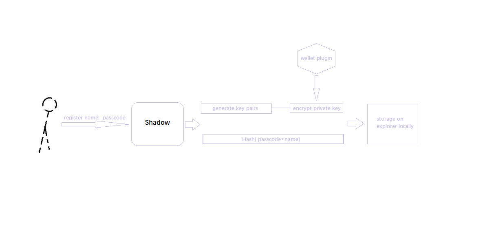
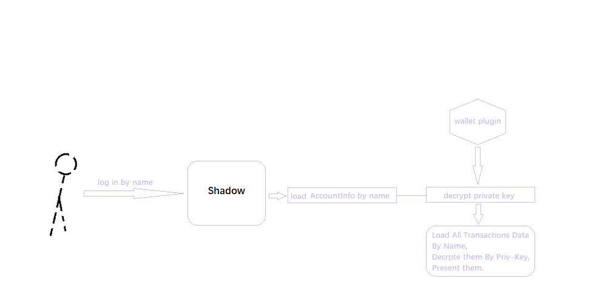
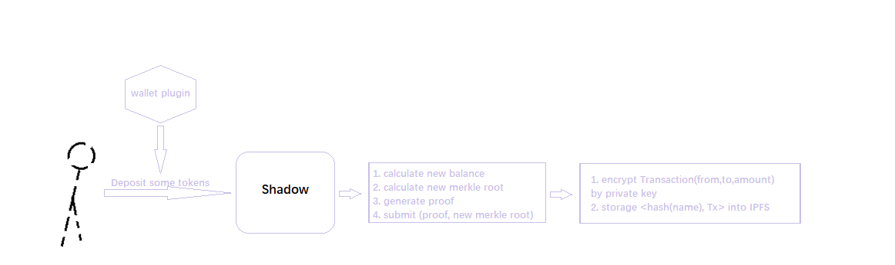
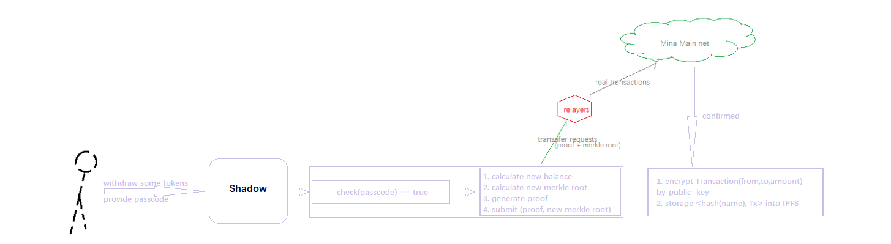
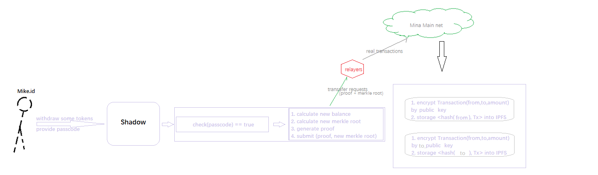

# Shadow -- A Private Account System On Mina

`This doc will present Shadow on a very high level.`

As we talked before, the mixer project is an extracted component from our original design of `zkPass`(Crypto Identity) for this Builder program. Based on this, this mixer project (named `Shadow`) is still based on the account model, which means everyone could register and hold a unique name in the scope. 

To keep this feature and also to keep privacy, we made great effort on the design of how to maintain `Deposition to mixer without name exposure`, `Transfer internally without any exposure`, and `Withdraw from mixer without name exposure`. 
So people could got a unique name in the crypto world and never worry about their asset operations to be traced in the scope.

 

## User Registration

 

Firstly, You need some amount of mina tokens on your wallet (plugin);

Secondly, Enter the index page, You are directed to provide your own unique name as well as a complex passcode which needs backuping it and is for Transfer&Withdraw section.

Then, the page will generate a key pairs locally for encryption and decryption of your account info & all transactions data.

Next, wallet plugin would be triggered to encrypte the private key and store it locally.

Last, You passcode above will also be stored as `Hash(passcode+name)` both on contract and locally.

## User Logon

 

Firstly, at the initial version, You could only log on `Shadow` on the original client(e.g. explorer) with the same wallet.(will be improved on future version)

Then, please provide your registered name and passcode.

Underlying, `Shadow` will load local AccountInfo by your name, and trigger wallet plugin to decrypt private key. Meanwhile, all your historical transaction data will by fetched back and decrypted by private key, and then present them on page to you.

## Deposit

 

Firstly, you need to prepare some mina tokens on your wallet.

Then, `Shadow` will direct you to transfer your specified amount of mina tokens by triggering wallet plugin and broadcast your transaction after getting your authorization.
During it, `Shadow` initials your account and updates your initial balance and generate proof attached insides.

Tips: on this section, Your transaction is from your wallet, which could be tracked.

## Withdraw

Firstly, you need to input the amount of depositing tokens as well as your target wallet address.

Then you are prompted for your passcode. Please enter.

Underlyingly, Shadow check if `Hash(passcode+name)` is equal to that on contract and update related data such as balance, merkle tree root and generating proof. 

Then send it as a whole to relayers to help generate valid transaction and broadcast it. Of course, you need to pay some fee(spent by balance on Shadow, consisting of two parts mainly: transaction cost and replayer fee) to relayers for this withdraw. 

## Transfer by name

Firstly, you need to input the amount of depositing tokens as well as your target reciever’s unique name.

Then you are prompted for your passcode. Please enter.
Underlyingly, Shadow check if `Hash(passcode+name)` is equal to that on contract and update related data such as balance, merkle tree root and generating proof. 
Besides, a `unrecieved transaction item` <hash(to), encryptedTx> will also generated as attached (for target reciever when it logs on), and a `transfer transaction item` <hash(from), encryptedTx> also is generated for history recording.

Then send it as a whole to relayers to help generate valid transaction and broadcast it. Of course, you need to pay some fee(spent by balance on `Shadow`, consisting of two parts mainly: transaction cost and replayer fee) to relayers for this withdraw. 

When the reciever log on, and will be presented all his/her `unrecieved transaction items`, then he/she will be directed to receive it by his/her authorization on wallet plugin and send this operation to relayer to generate a transaction and broadcast.

USE AT YOUR OWN RISK.
